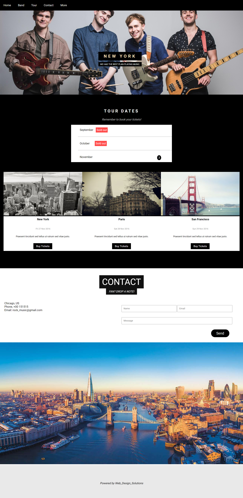

# 🎸 Rock Music Band Website

This is a responsive web page built using pure **HTML** and **CSS**, designed for a modern rock music band. The design is fully responsive across different screen sizes, making it ideal for showcasing band info, tour dates, media, and more.

## 🚀 Features

- Clean, responsive layout
- Modern and energetic design style
- Easy to customize
- Mobile-friendly UI
- HTML5 & CSS3 best practices

## 📸 Screenshot



## 📁 Folder Structure

```
├── index.html
├── css/
│   └── style.css
├── Screenshots/
│   └── screenshot1.jpg

````

## 💡 How to Use

1. Clone this repo:
   ```bash
   git clone https://github.com/Kamran0925/rock-musicband-website.git
````

2. Open `index.html` in your browser:

   ```bash
   open index.html
   ```

3. Or use Live Server extension in VSCode for development.

## 📬 Contact

If you like this project or want a custom music band site, feel free to reach out!

Made with ❤️ by Kamran Rizwan
